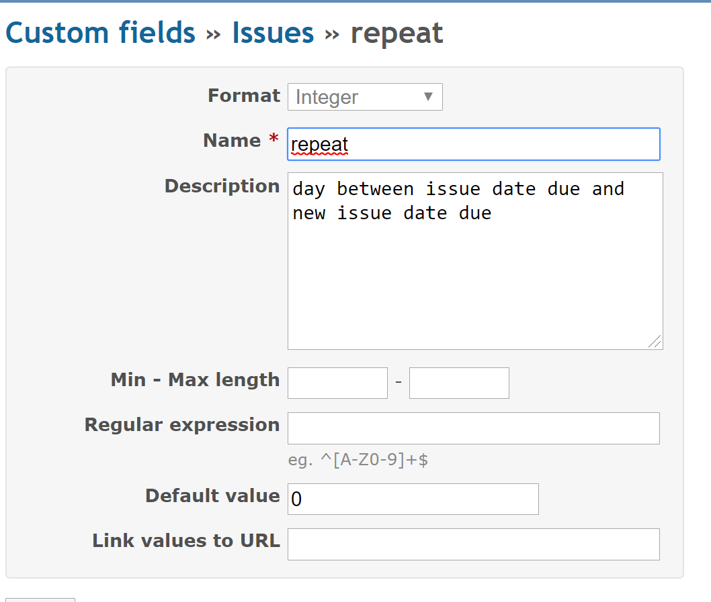

# Redmine Repeat

## Summary

When you closed a issue, it's possible to duplicate issue automatic

## Usage

You create a custom filed with name *repeat*, type integer default value 0




When you closed a issue:

- if issue has value in custom field *repeat* not equals to null, a new issue is created
- if issue has due date, the new issue has due date: due date + value of repeat 


## Installation

```
$ cd redmine/plugins
$ git clone https://github.com/fraoustin/redmine_repeat.git
```

restart Redmine
